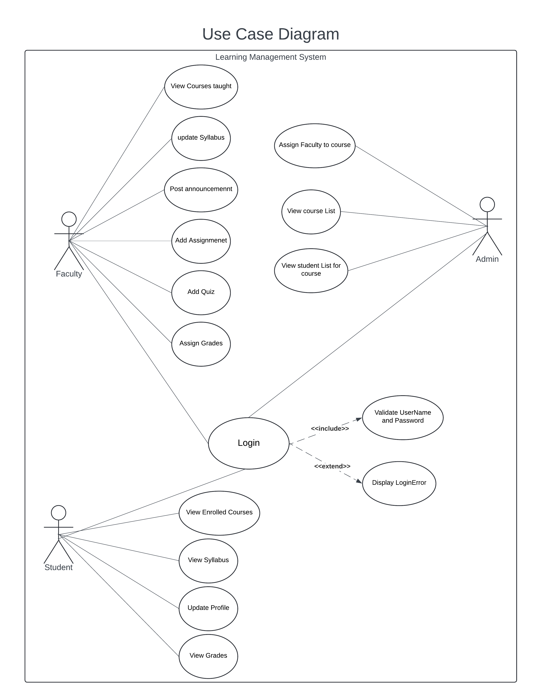

## Team Name - Kinetic

| Team Member| SJSU ID |
| --- | --- |
| Shreekar Kolanu | 017406493 |
| Pawan Aditya Man| 017506450 |
| Naga Varun Bathina| 017434261 |
|  Divyam Savsaviya | 017536714 |

An overview of the project structure. For example:

- backend/: Contains the backend code.
- frontend/: Contains the frontend code.
- Diagrams/: Contains diagrams related to the project.
- Project Journel/: Contains project journals.

# *Team Contributions*

| Team Member| TASKS |
| --- | --- |
| Divyam Savsaviya | Backend planning and architecture, meticulously crafting schemas for students, courses, and admin functionalities. Led testing efforts and coordinated task delegation within the team. Actively collaborated with team members to ensure seamless integration of backend components. Coordinated project tasks and effective communication.|
| Pawan Aditya Man | worked on creating UML diagrams and worked on backed for creating endpoints for faculty, course and also tested the endpoints for Admin and course. Created the collections on postman with all the listed APIs and also worked for Integrating frontend and backend.
| Naga Varun Bathina | worked on front end architecture, sign-up, login ui. Integration, with backend. The home page,Grading Assignments, creating Assignments, create Subject, Teacher and assisted in Cloud deployment and read-me file|
| Shreekar Kolanu | Worked on the Frontend, schemas and architecture. Routing multiple components for creating student and teacher modules and adding features like Announcements,Quiz etc and application deployment of the project with auto-scaling & load-balancer in Aws cloud EC2.|

# *Starting the Backend*

cd backend
npm start

# *Starting the Frontend*

cd frontend
npm start

# *Tech Stack*
*Frontend:* React JS

*Backend:* Node JS

*Database:* MongoDB Atlas

*Deployment :* EC2 with Load balancing(ALB) and ALG

# Design Choices

## Backend Development

### Backend Schemas and Routes

- Implemented robust backend schemas and routes for essential entities such as students, faculty, admin, assignments, announcements, quizzes, grades. This ensures a well-structured and organized data flow within the application.

### Scalability through Deployment

- Opted for EC2 with Load Balancing during deployment, ensuring scalability and reliability. This choice enables the application to efficiently handle varying loads, distributing traffic across multiple instances for improved performance.

### Database Choice

- Utilized MongoDB Atlas as the database solution. MongoDB's NoSQL architecture provides flexibility in handling diverse data types, facilitating efficient storage and retrieval of complex data structures relevant to the project.

### Authentication and Authorization

- Implemented JSON Web Token (JWT) based authentication for secure user sessions and authorization. JWTs provide a stateless approach to authentication, enhancing scalability and security.
- Utilized industry-standard bcrypt library for hashing and salting user passwords before storage, ensuring robust protection against brute-force attacks.

### Code Structure and Organization

- Followed a modular approach by separating concerns into different modules (e.g., controllers, services, models), promoting code reusability, maintainability, and testability.
- Leveraged middleware functions for common operations like error handling, request validation, and logging, improving code organization and consistency.

### API Design and Documentation

- Designed a RESTful API adhering to best practices, ensuring a consistent and intuitive interface for client-side interactions.
- Documented the API using tools like Swagger or Postman, providing clear and comprehensive information for developers to understand and consume the API effectively.

*Frontend Architecture and User Interface Design:*

1. *Comprehensive Frontend Architecture:*
   - Designed a comprehensive frontend architecture that encompasses key user interfaces, including the home page,creating subjects, posting quizzes, grading student, viewing grades. This design choice ensures a cohesive and seamless user experience.

2. *User-Focused UI Design:*
   - Prioritized user experience by focusing on user interfaces such as sign-up, login, and intuitive navigation across key pages. This design approach enhances user engagement and satisfaction.

3. *Documentation and Diagrams:*
   - Included detailed diagrams and a README file as part of the frontend architecture. This documentation provides clarity to developers and stakeholders, aiding in understanding the project's structure and facilitating smoother collaboration.

4. *Integrated Frontend with Backend:*
   - Integrated frontend components seamlessly with the backend, ensuring a cohesive and responsive application. This design choice enhances data flow and interaction between different layers of the application.

# *Journals*
Aditya's Journal

[AdityaProjectJournel.md](https://github.com/gopinathsjsu/teamprojectsection-01-cmpe202-tuesday-kinetic_spring/blob/d9f30e5edfdaf0ffbe92a4be6f14e01370a910dc/Project%20Journel/AdityaProjectJournel.md)

Shreekar's Journal

[ShreekarProjectJournal.md](https://github.com/gopinathsjsu/teamprojectsection-01-cmpe202-tuesday-kinetic_spring/blob/0808d8673349199cbbd294c2f01fe11d711a4a86/Project%20Journel/ShreekarProjectJournel.md)

Varun's Journal

[VarunProjectJournal.md](https://github.com/gopinathsjsu/teamprojectsection-01-cmpe202-tuesday-kinetic_spring/blob/0808d8673349199cbbd294c2f01fe11d711a4a86/Project%20Journel/VarunProjectJournal.md)

Divyam's Journal

[Divyamprojectjournel.md](https://github.com/gopinathsjsu/teamprojectsection-01-cmpe202-tuesday-kinetic_spring/blob/0808d8673349199cbbd294c2f01fe11d711a4a86/Project%20Journel/DivyamProjectJournel.md)

# *XP Values*

1. *Communication:*
   - Implemented a diverse set of communication channels, including weekly Zoom and WhatsApp status calls, supplemented by a dedicated collaboration platform (e.g., Slack or Microsoft Teams). This multi-channel approach facilitated real-time communication, quick updates, and dynamic discussions, fostering a more connected and agile development environment.

2. *Feedback:*
   - Instituted iterative review sessions at key development milestones, beyond regular status updates. Utilizing collaborative tools like Zoom and shared documents, these sessions allowed for real-time feedback from team members and stakeholders. This iterative feedback approach ensured swift adjustments, promoting a responsive and user-focused development cycle.

# *UI WIRE FRAMES*
[LMSWireframe Diagrams.pdf](https://github.com/gopinathsjsu/teamprojectsection-01-cmpe202-tuesday-kinetic_spring/blob/0808d8673349199cbbd294c2f01fe11d711a4a86/Diagrams/Frontend/LMSWireframe%20Diagrams.pdf)

# *Taskboard*

Kinetic_sprint_Taskboard

# *SprintSheet*
[Kinetic_sprint_Sheet](https://docs.google.com/spreadsheets/d/1XUy6MhAWf9W01H-3E-memAj81-pskUuxy5zylPwXCi8/edit?usp=sharing)

# *Features Set*

1. *User Authentication and Role-Based Access Control*:
   Implemented a secure user authentication system that allows Faculty, Students, and Admins to log in securely. Use role-based access control to enforce different levels of permissions and access privileges based on user roles. This ensures that each user can only access functionalities and information relevant to their role within the LMS.

2. *Homepage Customization Based on User Role*:
   Customize the homepage of the LMS based on the logged-in user's role. Faculty members should see a dashboard displaying courses they are teaching across different semesters, along with options to manage course content and grading. Students should see a list of their enrolled courses, upcoming assignments, and grades. Admins have access to course management tools and administrative functions.

3. *Course Management for Faculty*:
   Provide Faculty members with comprehensive course management tools to view, add, edit, and organize courses across different semesters. This includes the ability to upload course materials, set assignments and quizzes, post announcements, and manage student enrollment.

4. *Course Enrollment and Assignment Management*:
   Implement features for course enrollment, allowing Students to browse available courses and enroll in them. Admins should have the capability to assign Faculty members to teach specific courses for upcoming semesters, managing course allocations efficiently within the system.

5. *Content Management*:
   Enable Faculty to manage course content effectively by providing tools to upload, organize, and update course materials such as lectures, readings, and multimedia resources. Students should have access to view and download published course content, including assignments, quizzes, and supplementary materials.

6. *Grading System*:
   Develop a robust grading system that allows Faculty to evaluate and assign grades for student submissions. Provide a user-friendly interface for Faculty to input grades, provide feedback, and communicate assessment results to students. Students should be able to view their grades and feedback for each course they are enrolled in.

7. *Profile Management*:
   Offer users (Faculty, Students) have the ability to manage their profile information within the LMS. This includes updating personal details, contact information, and notification preferences to tailor their LMS experience according to individual preferences.

8. *Announcements and Communication Tools*:
   Implement features for Faculty to post announcements and communicate important updates to students within each course. Include messaging or notification functionalities to facilitate effective communication between Faculty and students regarding course-related matters.

9. *Assignment and Quiz Management*:
    Allow Faculty to create, manage, and distribute assignments and quizzes within the LMS. Students should be able to access assigned tasks, submit their work online, and receive automated feedback or grades based on Faculty evaluations.

10. *RESTful API Development*:
    Build RESTful APIs to support various LMS functionalities, allowing seamless integration with the front-end user interfaces (UIs) and facilitating data exchange between different components of the system. Ensure APIs are well-documented, secure, and efficient in handling requests and responses.

11. *Cloud Deployment*:
    Deploy the LMS backend (including APIs and database) on a cloud platform such as AWS (Amazon Web Services) to ensure scalability, reliability, and accessibility. Utilize auto-scaling features and load balancers to handle varying levels of user traffic and ensure high availability of the application.

12. *Responsive UI Design and Wireframes*:
    Create intuitive and responsive user interfaces (UIs) for the LMS, ensuring optimal user experience across devices (desktops, tablets, mobile phones). Develop wireframes and design mockups for key screens (e.g., course dashboard, profile settings) to visualize user interactions and navigation paths within the application.

# *USE CASE Diagram*

# *DEPLOYMENT DIAGRAM*

# *COMPONENT DIAGRAM*

# *ARCHITECTURE DIAGRAM*

# *BURNDOWN CHART*

